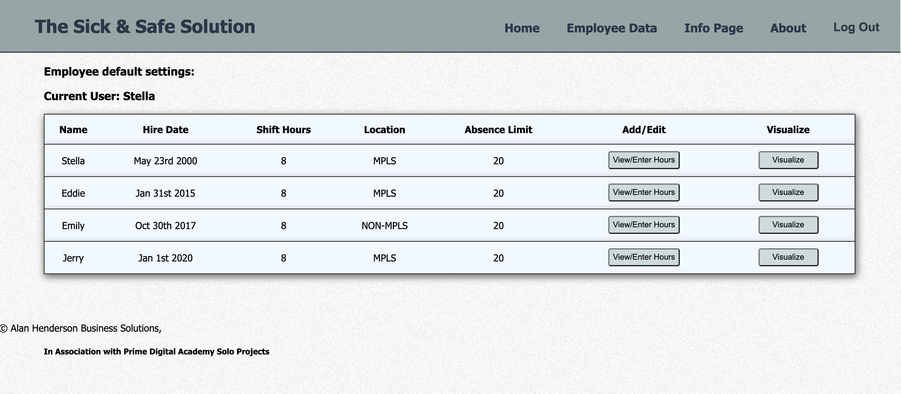
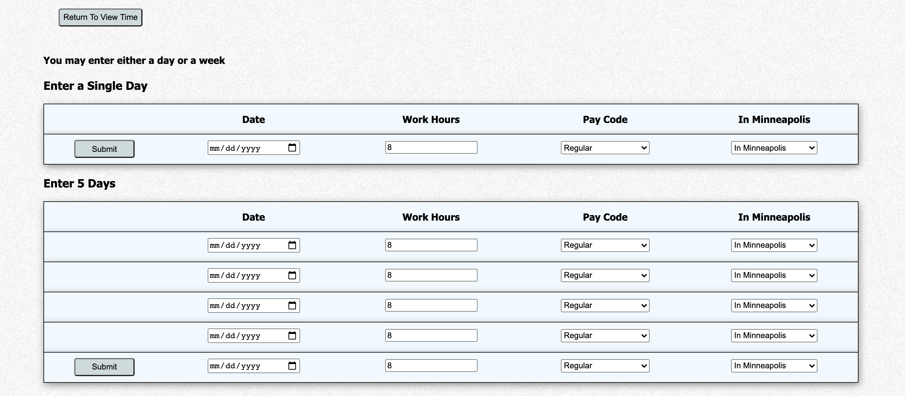
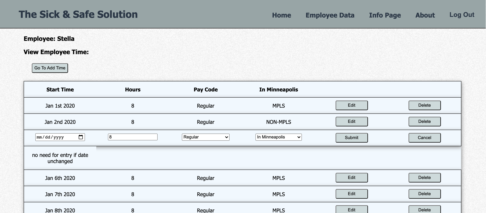
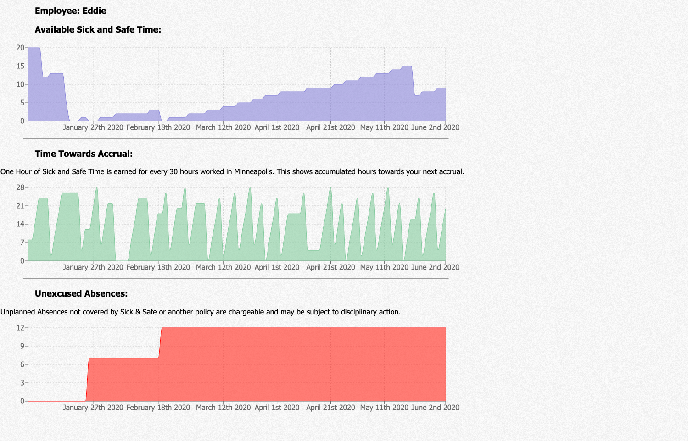

Sick & Safe payroll calculator:

This Application will help employers track Sick and Safe time for their employees. Sick & Safe time is a type of excused sick time created by a Minneapolis city ordinance. For every 30 hours that someone works in the city limits of minneapolis their employer must allow them one hour of Sick & Safe time which it is the responsibility of the employer to track.

The city didn't create any tool for tracking Sick and Safe time beyond a simple spread sheet and their are many edge cases that make tracking Sick & Safe time difficult. This application can evaluate Regular, Vacation, Sick, FMLA and Unplanned Absence not eligible for Sick & Safe time. It handles all of the edge cases and then graphs the data so the employer can explain it to their employee.

In the deployed version a user can create a supervisor profile, enter time for that supervisor, Edit or Delete those entires and see a graph showing current status. Functions to set carryover from the previous year, edit start dates and assign employees to the supervisor are currently all done directly in the SQL database.

Team Display:

Edit or Delete:

Add Hours:

Review the data in graph form:

This Project was my solo capstone-project at Prime Digital Academy.
It uses React, Redux, Express, Passport, and PostgreSQL, reChart (a full list of dependencies can be found in `package.json`).

